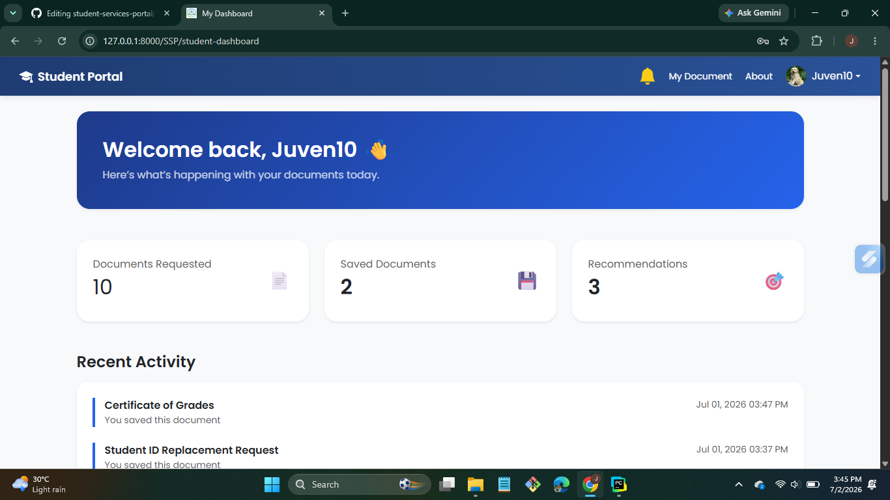
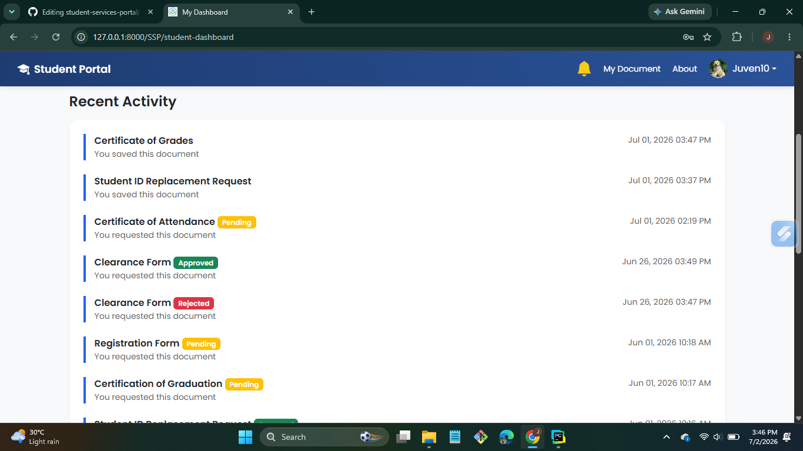
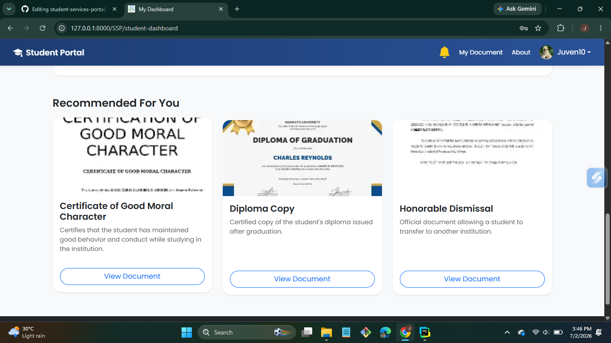
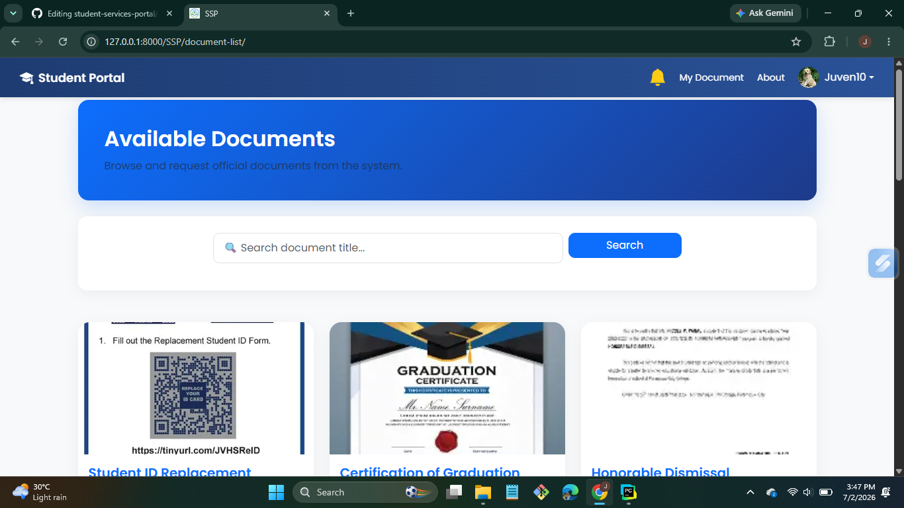
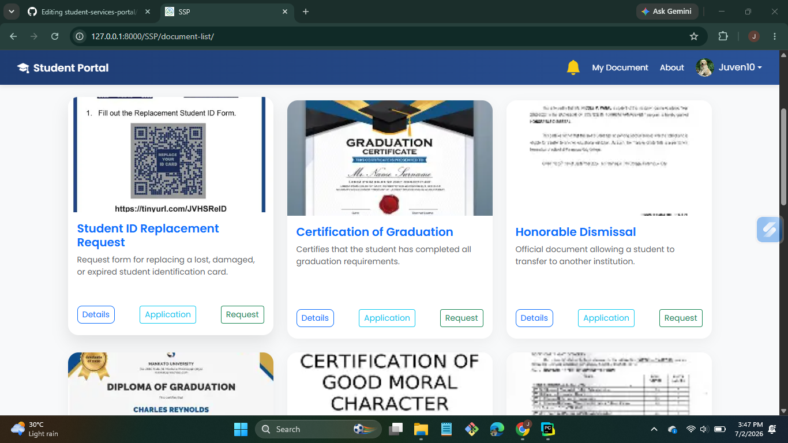
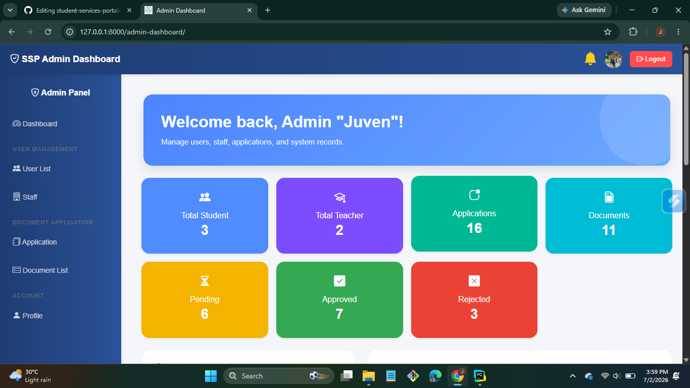
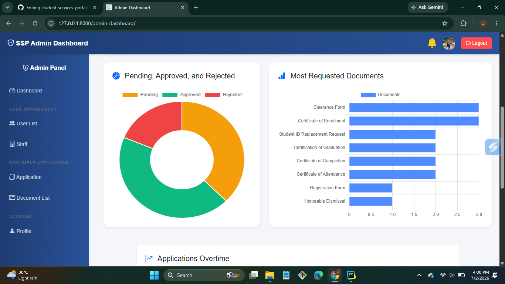
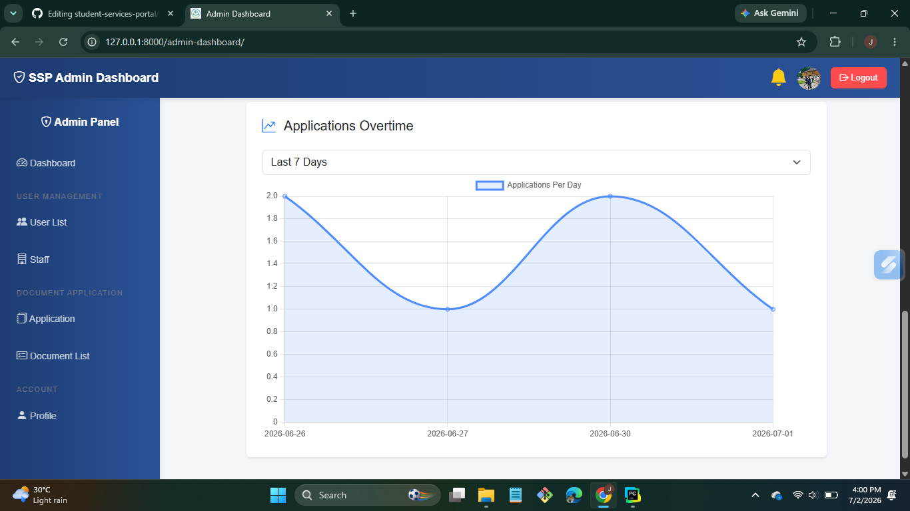

# 🎓 Student Services Portal (SSP)

## 📌 Overview

The **Student Services Portal (SSP)** is a role-based web application built with **Django** that simplifies the process of requesting and managing student documents.

The system includes secure authentication features such as **Email Verification**, **Password Reset via Email**, and **Role-Based Access Control** for Students, Staff, and Administrators.

Students can browse available documents, submit document requests, track application status, and receive notifications. Staff members manage document requests and review applications, while administrators oversee users, staff, documents, and the overall workflow.

---

## ✨ Features

### 👨‍🎓 Student
- User Registration
- Secure Login & Logout
- Email Verification
- Forgot Password / Reset Password
- Browse Available Documents
- Search Documents
- View Document Details
- Submit Document Requests
- Track Application Status
- Save / Unsave Favorite Documents
- Save Favorite Documents
- Notification System
- Profile Management

### 👨‍💼 Staff
- Dashboard
- Document Management
- Add New Documents
- Manage Document Requests
- Update Status
    - Pending
    - Approved
    - Rejected
- Manage Application & Reviews
- Application Statistics
- Recent Activities
- Notification System
- Profile Management

### 👨‍💻 Administrator
- Dashboard
- User Management
- Staff Management
- Application Management
- Document Management
- Reports & Statistics
- Charts and Analytics
- Notification System
- Profile Management

---

## 🔐 Authentication

- Email Verification
- Password Reset via Email
- Role-Based Authentication
- Secure Login & Logout

---

## 📊 Dashboard

### Student Dashboard
- Document Statistics
- Saved Documents
- Recommendations
- Recent Activities

### Staff Dashboard
- Posted Documents
- Applications Overview
- Pending, Approved, and Rejected Statistics
- Recent Applications
- Activity Timeline
- Charts

### Admin Dashboard
- User Statistics
- Staff Statistics
- Document Statistics
- Application Statistics
- Pending, Approved, and Rejected Reports
- Application Analytics
- Charts

---

## 🛠️ Built With

- Python
- Django
- Bootstrap 5
- HTML5
- CSS3
- JavaScript
- Chart.js
- SQLite (Development)

---

## 📸 Screenshots
## Student/Course listing






## Staff dashboard


## Admin dashboard




---

## 👨‍💻 Developed By

**Juven T. Pinoy**

Bachelor of Science in Information Technology

Carlos Hilado Memorial State University

Class of 2025

---

## ⚙️ Installation

### 1. Clone the repository

```bash
git clone https://github.com/Juven165/student-services-portal.git
```

### 2. Navigate to the project directory

```bash
cd student-services-portal
```

### 3. Create a virtual environment

```bash
python -m venv venv
```

### 4. Activate the virtual environment

**Windows**

```bash
venv\Scripts\activate
```

**macOS / Linux**

```bash
source venv/bin/activate
```

### 5. Install the required packages

```bash
pip install -r requirements.txt
```

### 6. Apply database migrations

```bash
python manage.py migrate
```

### 7. Create a superuser (optional)

```bash
python manage.py createsuperuser
```

### 8. Run the development server

```bash
python manage.py runserver
```

Open your browser and visit:

```
http://127.0.0.1:8000/
```
